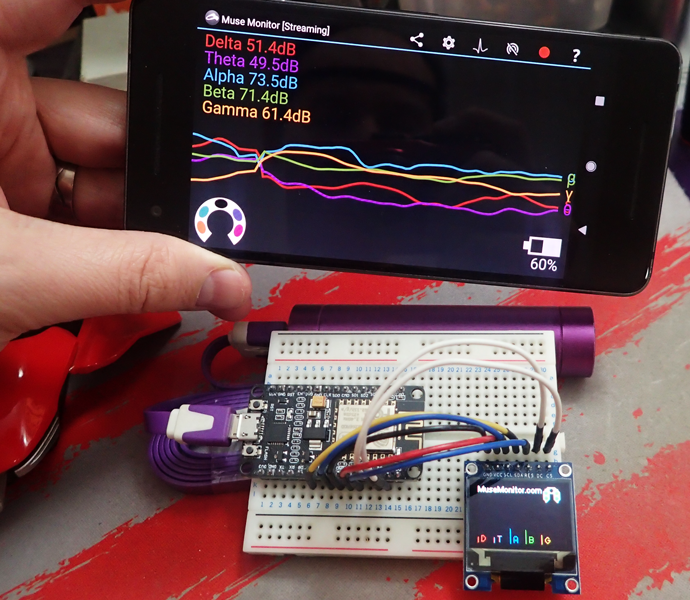

#  ESP8266 Muse Monitor OSC Receiver Example by James Clutterbuck [MuseMonitor.com](https://www.MuseMonitor.com)

This code sample is to demonstrate streaming live OSC brainwave data from Muse Monitor (connected to a Muse device), to an ESP8266 WiFi SoC, which can then interface with real world components, such as lighting, servos and in this example a color OLED display.

## Requirements:
  * [Arduino core for ESP8266](https://github.com/esp8266/Arduino) (To enable programming the ESP8266 with the Arduino IDE)
  * [Arduino OSC library](https://github.com/CNMAT/OSC)
  * [ESP8266 NodeMCU 1.0 (ESP-12E Module)](https://www.banggood.com/NodeMcu-Lua-WIFI-Internet-Things-Development-Board-Based-ESP8266-CP2102-Wireless-Module-p-1097112.html)
  * [SSD1331 Color OLED (96x64)](https://www.banggood.com/0_95-Inch-7pin-Full-Color-65K-Color-SSD1331-SPI-OLED-Display-For-Arduino-p-1068167.html)
  
###  SSD1331 OLED Wiring:
| **ESP**  | GND | 3V3 | D5  | D7  | D4  | D1 | D2 |
| -------- | --- | --- | --- | --- | --- | -- | -- |
| **OLED** | GND | VCC | SCL | SDA | RES | DC | CS |

## Features:
  * Splashscreen showing Wifi SSID Name, IP Address and Port.
  * Live OSC bundle message processing from Muse Monitor.
  * Autodetection of Single or four channel absolute waves (/muse/elements/*_absolute).
  * Horseshoe indicator showing headband fit (/muse/elements/horseshoe, /muse/elements/touching_forehead).
  * Relative brainwaves (Delta, Theta, Alpha, Beta, Gamma) calculated from absolutes.
  * Automatic timeout to splash screen when no data received.